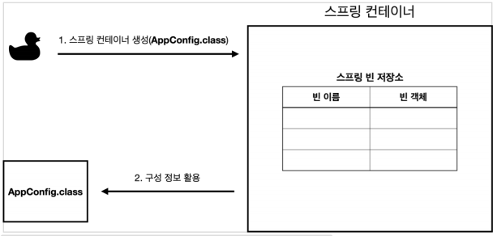
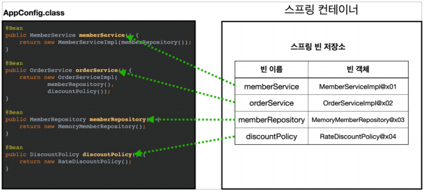

# 스프링 컨테이너 생성    
```java  
ApplicationContext applicationContext = new AnnotationConfigApplicationContext(AppConfig.class);    
```
* `ApplicationContext`를 스프링 컨테이너라 부른다.   
* `ApplicationContext`는 인터페이스다.(다형성 적용, 이를 구현한 구현체를 사용한다)      
* 스프링 컨테이너는 `XML` 기반으로 만들 수 있고, **애노테이션 기반의 자바 설정 클래스로 만들 수 있다.**  
* 직전에 `AppConfig`를 사용했던 방식이 `애노테이션 기반의 자바 설정 클래스`로 스프링 컨테이너를 만든 것이다.   
* 자바 설정 클래스를 기반으로 스프링 컨테이너 `ApplicationContext`를 만들어 보자  
  * `new AnnotationConfigApplicationContext(AppConfig.class)`    
  * 이 클래스는 `ApplicationContext` 인터페이스의 구현체이다. (참고로 여러개 있다.)   
 
좀 더 정확히 말하면 스프링 컨테이너는 2가지로 나뉜다.    
   
* BeanFactory   
* ApplicationContext   

이 부분에 대해서 [필자가 정리한 내용]()이 있으니 이를 참고하자     

## 스프링 컨테이너의 생성 과정
### 1. 스프링 컨테이너 생성   


* `new AnnotaionConfigApplicationContext(AppConfig.class)` 
* 스프링 컨테이너는 생성되면서 내부적으로 `스프링 빈 저장소`를 갖는다.  
* 이름 그대로 빈을 저장하는 용도로 사용되는 저장소이다.   
* 이때, 생성자에 인자값으로 넘긴 클래스를 기준으로 `스프링 빈 저장소`를 채워넣을 예정이다.
  
### 2. 스프링 빈 등록     

    
* 스프링 컨테이너에서 생성자에 인자값으로 넘긴 클래스에 존재하는 메서드를 모두 호출한다.   
* 호출하면서 반환된 객체들을 `스프링 빈 저장소`에 저장하게 된다.  
* 이때, 별 다른 설정을 주지 않으면 `메서드의 이름을 key 값`으로 저장한다.
* `@Bean(name="다른 이름")`으로 사용자가 특정 이름으로 지정해줄 수 있다.  
* **주의 :** 
    빈 이름은 **항상 다른 이름을 부여**해야 한다.   
    같은 이름을 부여하면 다른 빈이 무시되거나, 기존 빈을 덮어버리거나, 설정에 따라 오류가 발생한다.  
### 3. 스프링 의존관계 설정 - 준비  
    

4. 스프링 의존관계 설정 - 완료    
     
  
* 스프링 컨테이너는 **설정 정보를 참고**해서 의존관계를 `주입(DI)`한다.     
* 단순히 메서드를 호출하고 반환된 객체로 의존관계를 `주입(DI)`하는 것은 아니다.  
* 단순히 자바 코드를 호출하는 것 같지만, 싱글톤 컨테이너에 대해서 설명하면서 함께 알아보자    

**참고**   
스프링은 **빈을 생성**하고, **의존관계를 주입**하는 단계가 나누어져있다.     
그런데 이렇게 `자바 코드로 스프링 빈을 등록`하면     
**생성자를 호출하면서 의존관계 주입도 한번에 처리한다.**       
자세한 내용은 의존관계 자동 주입에서 다시 설명할 예정이다.         
중요한 점은, 기본적으로는 **빈을 생성**하고, **의존관계를 주입**하는 단계가 나누어져있다.     
        
# 컨테이너에 등록된 모든 빈 조회   

```java
package hello.core.beanfind;

import hello.core.AppConfig;
import org.junit.jupiter.api.DisplayName;
import org.junit.jupiter.api.Test;
import org.springframework.beans.factory.config.BeanDefinition;
import org.springframework.context.annotation.AnnotationConfigApplicationContext;

public class ApplicationContextInfoTest {

    AnnotationConfigApplicationContext ac = new AnnotationConfigApplicationContext(AppConfig.class);

    @DisplayName("모든 빈 출력하기")
    @Test
    void findAllBean() {
        String[] beanDefinitionNames = ac.getBeanDefinitionNames();

        for (String beanDefinitionName : beanDefinitionNames) {
            Object bean = ac.getBean(beanDefinitionName);
            System.out.println("name = " + beanDefinitionName + " Object = " + bean);
        }

    }

    @DisplayName("애플리케이션 빈 출력하기")
    @Test
    void findApplicationBean() {
        String[] beanDefinitionNames = ac.getBeanDefinitionNames();

        for (String beanDefinitionName : beanDefinitionNames) {
            BeanDefinition beanDefinition = ac.getBeanDefinition(beanDefinitionName);

            // BeanDefinition.ROLE_APPLICATION : 직접 등록한 애플리케이션 빈
            // BeanDefinition.ROLE_INFRASTRUCTURE : 스프링이 내부에서 사용하는 빈
            if (beanDefinition.getRole() == BeanDefinition.ROLE_APPLICATION) {
                Object bean = ac.getBean(beanDefinitionName);
                System.out.println("name = " + beanDefinitionName + " Object = " + bean);
            }

        }

    }

}
```
**모든 빈 출력하기**   
* 실행하면 스프링에 등록된 모든 빈 정보를 출력할 수 있다.  
* `ac.getBeanDefinitionNames()` 스프링에 등록된 모든 빈 이름을 조회한다.  
* `ac.getBean()` 빈 이름으로 객체를 조회한다.   

**애플리케이션 빈 출력하기**   
* 스프링이 내부에서 사용하는 빈은 제외하고, 내가 등록한 빈만 출력하기   
* 스프링이 내부에서 사용하는 빈은 `getRole()`로 구분할 수 있다.   
    * ROLE_APPLICATION : 일반적으로 사용자가 정의한 빈 
    * ROLE_INFRASTRUCTURE : 스프링 내부에서 사용하는 빈  

# 스프링 빈 조회 - 기본  
스프링 컨테이너에서 빈을 조회하는 가장 기본적인 방법은 아래와 같다.    
        
* `ac.getBean(빈이름, 타입)`        
* `ac.getBena(타입)`    
* 조회 대상 스프링 빈이 없으면 예외 발생   
* `noSuchBeanDefinitionException: No Bean named 'xxxxx' avaiable`    


```java
package hello.core.beanfind;

import hello.core.AppConfig;
import hello.core.member.MemberService;
import hello.core.member.MemberServiceImpl;
import org.junit.jupiter.api.DisplayName;
import org.junit.jupiter.api.Test;
import org.springframework.beans.factory.NoSuchBeanDefinitionException;
import org.springframework.context.annotation.AnnotationConfigApplicationContext;

import static org.assertj.core.api.Assertions.assertThat;
import static org.assertj.core.api.Assertions.assertThatThrownBy;

public class ApplicationContextBasicFindTest {
    AnnotationConfigApplicationContext ac = new AnnotationConfigApplicationContext(AppConfig.class);

    @DisplayName("빈 이름으로 조회")
    @Test
    void findBeanByName() {
        MemberService memberService = ac.getBean("memberService", MemberService.class);
        assertThat(memberService).isInstanceOf(MemberServiceImpl.class);

    }

    @DisplayName("이름없이 타입으로만 조회")
    @Test
    void findBeanByType() {
        MemberService memberService = ac.getBean(MemberService.class);
        assertThat(memberService).isInstanceOf(MemberServiceImpl.class);

    }

    @DisplayName("구현체 타입으로만 조회")
    @Test
    void findBeanByName2() {
        // 별로 좋은 코드는 아니지만, 이렇게도 사용 가능하다.
        MemberService memberService = ac.getBean("memberService", MemberServiceImpl.class);
        assertThat(memberService).isInstanceOf(MemberServiceImpl.class);
    }

    @DisplayName("빈 이름으로 조회X")
    @Test
    void findBeanByNameX() {
        // NoSuchBeanDefinitionException 예외 발생
        assertThatThrownBy(()-> ac.getBean("xxxxx", MemberService.class))
                .isInstanceOf(NoSuchBeanDefinitionException.class);
    }

}

```

# 스프링 빈 조회 - 동일한 타입 둘 이상
타입으로 조회시 같은 타입의 스프링 빈이 둘 이상이면 오류가 발생한다. 이때는 빈 이름을 지정하자   
* `ac.getBeanOfType()`을 사용하면 해당 타입의 모든 빈을 조회할 수 있다.  
  
**예제코드**   
```java
package hello.core.beanfind;

import hello.core.member.MemberRepository;
import hello.core.member.MemoryMemberRepository;
import org.junit.jupiter.api.DisplayName;
import org.junit.jupiter.api.Test;
import org.springframework.beans.factory.NoUniqueBeanDefinitionException;
import org.springframework.context.annotation.AnnotationConfigApplicationContext;
import org.springframework.context.annotation.Bean;
import org.springframework.context.annotation.Configuration;

import java.util.Map;

import static org.assertj.core.api.Assertions.assertThat;
import static org.assertj.core.api.Assertions.assertThatThrownBy;


public class ApplicationContextSameBeanFindTest {

    AnnotationConfigApplicationContext ac = new AnnotationConfigApplicationContext(SameBeanConfig.class);


    @Configuration
    static class SameBeanConfig {

        @Bean
        public MemberRepository memberRepository1() {
            return new MemoryMemberRepository();
        }

        @Bean
        public MemberRepository memberRepository2() {
            return new MemoryMemberRepository();
        }

    }

    @DisplayName("타입으로 조회시 같은 타입이 둘 이상 있으면, 중복 오류가 발생한다.")
    @Test
    void findBeanByTypeDuplicate() {
        assertThatThrownBy(() -> ac.getBean(MemberRepository.class))
                .isInstanceOf(NoUniqueBeanDefinitionException.class);
    }

    @DisplayName("타입으로 조회시 같은 타입이 둘 이상 있으면, 빈 이름을 지정해주면 된다.")
    @Test
    void findBeanByName() {
        MemberRepository memberRepository = ac.getBean("memberRepository1", MemberRepository.class);
        assertThat(memberRepository).isInstanceOf(MemberRepository.class);
    }


    @DisplayName("특정 타입을 모두 조회하기")
    @Test
    void findAllBeanByType() {
        Map<String, MemberRepository> beansOfType = ac.getBeansOfType(MemberRepository.class);
        for (String key : beansOfType.keySet()) {
            System.out.println("key = " + key + " value" + beansOfType.get(key));
        }
        System.out.println("beansOfType = " + beansOfType);
        assertThat(beansOfType.size()).isEqualTo(2);
    }


}

```
   
# 스프링 빈 조회 - 상속 관계      
부모 타입으로 조회하면, 자식 타입도 함꼐 조회한다.       
그래서 모든 자바 객체의 최고 부모인 `Object`타입으로 조회하면 모든 스프링 빈을 조회한다.     

```java
package hello.core.beanfind;

import hello.core.AppConfig;
import hello.core.discount.DiscountPolicy;
import hello.core.discount.FixDiscountPolicy;
import hello.core.discount.RateDiscountPolicy;
import org.junit.jupiter.api.DisplayName;
import org.junit.jupiter.api.Test;
import org.springframework.beans.factory.NoUniqueBeanDefinitionException;
import org.springframework.context.annotation.AnnotationConfigApplicationContext;
import org.springframework.context.annotation.Bean;
import org.springframework.context.annotation.Configuration;

import java.util.Map;

import static org.assertj.core.api.Assertions.assertThat;
import static org.assertj.core.api.Assertions.assertThatThrownBy;

public class ApplicationContextExtendsFindTest {

    AnnotationConfigApplicationContext ac = new AnnotationConfigApplicationContext(TestConfig.class);

    @Configuration
    static class TestConfig {

        @Bean
        public DiscountPolicy rateDiscountPolicy() {
            return new RateDiscountPolicy();
        }

        @Bean
        public DiscountPolicy fixDiscountPolicy() {
            return new FixDiscountPolicy();
        }

    }

    @DisplayName("부모 타입으로 조회시, 자식이 둘 이상 있으면 애러가 발생한다.")
    @Test
    void findBeanByParentTypeDuplicate() {
        assertThatThrownBy(() -> ac.getBean(DiscountPolicy.class))
                .isInstanceOf(NoUniqueBeanDefinitionException.class);
    }

    @DisplayName("부모 타입으로 조회시, 자식이 둘 이상 있으면, 빈 이름을 지정하면 된다.")
    @Test
    void findBeanByParentTypeBeanName() {
        DiscountPolicy rateDiscountPolicy = ac.getBean("rateDiscountPolicy", DiscountPolicy.class);
        assertThat(rateDiscountPolicy).isInstanceOf(RateDiscountPolicy.class);
    }


    @DisplayName("부모 타입으로 조회시, 자식이 둘 이상 있으면, 특정 하위 타입으로 지정하면 된다.")
    @Test
    void findBeanSubType() {
        RateDiscountPolicy rateDiscountPolicy = ac.getBean(RateDiscountPolicy.class);
        assertThat(rateDiscountPolicy).isInstanceOf(RateDiscountPolicy.class);
    }

    @DisplayName("부모 타입으로 모두 조회하기")
    @Test
    void findAllBeanByParentType() {
        Map<String, DiscountPolicy> beansOfType = ac.getBeansOfType(DiscountPolicy.class);
        assertThat(beansOfType.size()).isEqualTo(2);
        for (String key : beansOfType.keySet()) {
            System.out.println("key = " + key + " value = " + beansOfType.get(key));
        }
    }

    @DisplayName("부모 타입으로 모두 조회하기 - Object")
    @Test
    void findAllBeanByObjectType() {
        Map<String, Object> beansOfType = ac.getBeansOfType(Object.class);
        for (String key : beansOfType.keySet()) {
            System.out.println("key = " + key + " value = " + beansOfType.get(key));
        }
    }

}

```

# BeanFactory와 ApplicationContext   

**BeanFactory**   
* 스프링 컨테이너의 최상위 인터페이스다.   
* 스프링 빈을 관리하고 조회하는 역할을 한다.   
* `getBean()`을 제공한다.
* 우리가 사용했던 대부분의 기능은 `BeanFactory`기능들이었다.  

**ApplicationContext**
* `BeanFactory`의 모든 기능을 그대로 제공한다.   
* 빈을 관리하고 검색하는 기능을 `BeanFactory`가 이미 해주는데 무슨 차이가 있지?   
* 애플리케이션을 개발할 때는 빈을 관리하고 조회하는 기능은 물론, 더 많은 부가기능이 필요하다.  
   
* **메시지 소스를 활용한 국제화 기능 :**   
  한국에서 들어오면 한국어로, 영어권에서 들어오면 영어로 출력 
  파일을 여러개로 분리해서 들어온 IP에 따라 알맞는 언어로 처리한다.    
  
* **환경변수 :**   
  로컬, 개발, 운영등을 구분해서 처리   
  
* **애플리케이션 이벤트 :**
  이벤트를 발행하고 구독하는 모델을 편리하게 지원 
* **편리한 리소스 조회 :**
  파일, 클래스패스, 외부 등에서 리소스를 편리하게 조회  
  
**정리**
* `ApplicationContext`는 `BeanFactory`의 기능을 상속받는다.  
* `ApplicationContext`는 빈 관리기능 + 편리한 부가 기능을 제공한다.   
* `BeanFactory`를 직접 사용할 일은 거의 없다. 부가기능이 포함된 `ApplicationContext`를 사용한다.
* `BeanFactory`나 `ApplicationContext`를 스프링 컨테이너라 부른다. 

# 다양한 설정 형식 지원 - 자바코드,XML  
스프링 컨테이너는 다양한 형식의 설정 정보를 받아드릴 수 있게 유연하게 설계되어 있다.   
자바, XML, Groovy 등등 심지어 임의의 어떤 언어로도 만들 수 있다.  

**애노테이션 기반 자바 코드 설정 사용**    
* 지금까지 우리가 사용했던 방식이다.  
* `new AnnotaionConfigApplicationContext(클래스이름.class)`
* `AnnotaionConfigApplicationContext` 클래스를 사용하면서 자바 코드로된 설정 정보를 넘기면 된다.   

**XML 설정 사용**  
* 최근에는 스프링 부트를 많이 사용하면서 `XML 기반`의 설정은 잘 사용하지 않는다.   
  아직 많은 레거시 코드들이 `XML`로 되어 있고,     
  `XML`을 사용하면 컴파일 없이 빈 설정 정보를 변경할 수 있는 장점도 있으므로    
  한번쯤은 배워도 나쁘지는 않다.     
* `GenericXmlApplicationContext`를 사용하면서 `xml` 설정 파일을 넘기면 된다.   

**설정 xml파일**
```xml
<?xml version="1.0" encoding="UTF-8"?>
<beans xmlns="http://www.springframework.org/schema/beans"
       xmlns:xsi="http://www.w3.org/2001/XMLSchema-instance"
       xsi:schemaLocation="http://www.springframework.org/schema/beans http://www.springframework.org/schema/beans/spring-beans.xsd">

    <bean id="memberService" class="hello.core.member.MemberServiceImpl">
        <constructor-arg name="memberRepository" ref="memberRepository"/>
    </bean>

    <bean id="memberRepository" class="hello.core.member.MemoryMemberRepository"/>

    <bean id="orderService" class="hello.core.order.OrderServiceImpl">
        <constructor-arg name="memberRepository" ref="memberRepository"/>
        <constructor-arg name="discountPolicy" ref="discountPolicy"/>
    </bean>

    <bean id="discountPolicy" class="hello.core.discount.RateDiscountPolicy"/>
</beans>
```

**XMLAppConfig 사용 자바 코드**   
```java
package hello.core.xml;

import hello.core.member.MemberService;
import org.junit.jupiter.api.Test;
import org.springframework.context.ApplicationContext;
import org.springframework.context.support.GenericXmlApplicationContext;

import static org.assertj.core.api.Assertions.assertThat;

public class XmlAppContext {

    @Test
    void xmlAppContext() {
        ApplicationContext ac = new GenericXmlApplicationContext("appConfig.xml");
        MemberService memberService = ac.getBean("memberService", MemberService.class);
        assertThat(memberService).isInstanceOf(MemberService.class);
    }
}
```

# 스프링 빈 설정 메타 정보 - BeanDefinition   
스프링은 어떻게 이런 다양한 설정 형식을 지원하는 것일까?     
그 중심에는 `BeanDefinition`이라는 추상화가 있다. (빈 정보 자체를 추상화)     

쉽게 이야기해서 **`역할`과 `구현`을 개념적으로 나눈 것이다.**        
* `XML`을 읽어서 `BeanDefinition`을 만들면 된다.   
* 자바코드를 읽어서 `BeanDefinition`을 만들면 된다.   
* 스프링 컨테이너는 자바 코드인지, XML인지 몰라도 오로지 `BeanDefinition`만 알면 된다.   
        
`BeanDefinition`을 빈 메타 정보라고 말한다.      
* `@Bean`, `<bean>`당 각각 하나씩 메타 정보가 생성된다.      
* 스프링 컨테이너는 이 메타 정보를 기반으로 스프링 빈을 생성한다.      
 
[사진]()    
[사진]()    
       
`BeanDefinition` 인터페이스를 구현한 클래스들은        
`BeanDefinitionReader`인터페이스를 구현한 구현체를 의존하고 있다.        
        
`BeanDefinitionReader` 인터페이스는 설정파일(자바,xml,..등등)에서 정보를 읽는 역할을 한다.            
그리고 설정파일을 기반으로 `BeanDefinition`을 생성하는 역할을 한다.         
정확히 말하면 `Bean`의 메타정보를 읽어오는 것이다.    
    
* `AnnotationConfigApplicationContext`는 `AnnotatedBeanDefinitionReader`를 사용해서     
  `AppConfig.class`를 읽고, `BeanDefinition`을 생성한다.      
* `GenericXmlConfigApplicationContext`는 `XmlBeanDefinitionReader`를 사용해서     
  `AppConfig.xml`을 읽고, `BeanDefinition`을 생성한다.       
* 새로운 형식의 설정 정보가 추가되면, `XxxBeanDefinitionReader`를 만들어서 `BeanDefinition`을 생성하면 된다.  
       
**`XxxBeanDefinitionReader` 만드는 방법은? 🤔**        
구글링을 해도 방법이 나오지 않는다!! (오히려 만들면 최초이기에 흥미가 돋는다.)         
지금은 집중해야할 것이 있으니 나중에 만드는 방법을 직접 찾아봐야겠다.       
`JSONBeanDefinition`이라는 주제로 만들어보자  

## BeanDefinition 살펴보기 
* **BeanClassName:** 생성할 빈의 클래스 명(자바 설정 처럼 팩토리 역할의 빈을 사용하면 없음)
* **factoryBeanName:** 팩토리 역할의 빈을 사용할 경우 이름, 예) appConfig
* **factoryMethodName:** 빈을 생성할 팩토리 메서드 지정, 예) memberService
* **Scope:** 싱글톤(기본값)
* **lazyInit:** 스프링 컨테이너를 생성할 때 빈을 생성하는 것이 아니라, 실제 빈을 사용할 때 까지 최대한 생성을 지연처리 하는지 여부  
* **InitMethodName:** 빈을 생성하고, 의존관계를 적용한 뒤에 호출되는 초기화 메서드 명    
* **DestroyMethodName:** 빈의 생명주기가 끝나서 제거하기 직전에 호출되는 메서드 명    
* **Constructor arguments, Properties:** 의존관계 주입에서 사용한다. (자바 설정 처럼 팩토리 역할의 빈을 사용하면 없음)     

**코드로 확인해보기**
```java
package hello.core.beandefinition;

import hello.core.AppConfig;
import org.junit.jupiter.api.DisplayName;
import org.junit.jupiter.api.Test;
import org.springframework.beans.factory.config.BeanDefinition;
import org.springframework.context.annotation.AnnotationConfigApplicationContext;
import org.springframework.context.support.GenericXmlApplicationContext;

public class BeanDefinitionTest {

    AnnotationConfigApplicationContext annotationConfigApplicationContext = new AnnotationConfigApplicationContext(AppConfig.class);
    GenericXmlApplicationContext xmlApplicationContext = new GenericXmlApplicationContext("appConfig.xml");

    @Test
    @DisplayName("빈 설정 메타정보 확인")
    void findAnnotationApplicationBean() {
        String[] beanDefinitionNames = annotationConfigApplicationContext.getBeanDefinitionNames();
        for (String beanDefinitionName : beanDefinitionNames) {
            BeanDefinition beanDefinition = annotationConfigApplicationContext.getBeanDefinition(beanDefinitionName);

            if (beanDefinition.getRole() == BeanDefinition.ROLE_APPLICATION) {
                System.out.println("beanDefinitionName = " + beanDefinitionName +
                        " beanDefinition = " + beanDefinition);
            }
        }
    }

    @Test
    @DisplayName("빈 설정 메타정보 확인")
    void findXmlApplicationBean() {
        String[] beanDefinitionNames = xmlApplicationContext.getBeanDefinitionNames();
        for (String beanDefinitionName : beanDefinitionNames) {
            BeanDefinition beanDefinition = xmlApplicationContext.getBeanDefinition(beanDefinitionName);

            if (beanDefinition.getRole() == BeanDefinition.ROLE_APPLICATION) {
                System.out.println("beanDefinitionName = " + beanDefinitionName +
                        " beanDefinition = " + beanDefinition);
            }
        }
    }

}
```
   
**정리**     
* `BeanDefinition`을 직접 생성해서 스프링 컨테이너에 등록할 수 도 있다.         
  하지만 실무에서 `BeanDefinition`을 직접 정의하거나 사용할 일은 거의 없다.           
  그래도 나중에 직접 구현을 해보는 편이 개발자 다운 삶이지 않을까 싶다.        
* `BeanDefinition`에 대해서는 너무 깊이있게 이해하기 보다는,     
  스프링이 다양한 형태의 설정 정보를 `BeanDefinition`으로 추상화해서 사용하는 것 정도만 이해하자      
* 가끔 스프링 코드나 스프링 관련 오픈 소스의 코드를 볼 때,`BeanDefinition` 이라는 것이 보일 때가 있다.    
  이때 이러한 메커니즘을 떠올리면 된다.   
      
**필자가 생각하기론**      
인스턴스를 만들어 반환하는 것은 단순히 자바 코드를 수행하기 위한 작업일 뿐이고      
`BeanDefinitionReader` 구현체가 해당 클래스를 통해 정보를 읽어들어와          
`BeanDefinition`이라는 메타데이터를 만들고, 이를 통해 다시 객체를 새로 생성한다고 생각한다.      
       
**참고로 `ApplicationContext`로 의존하지 않은 이유는? 🤔**   
* `ApplicationContext`에서는 `getBeanDefinition()`이라는 메서드가 존재하지 않는다.    

**그리고**   
`GenericXmlApplicationContext` 인스턴스는 
**factoryBeanName**, **factoryMethodName** 요소가 null로 빠져있다.   
           
사실 이러한 이유에 대해서 아래 내용을 참고하자   
스프링에 빈을 등록하는 방법이 크게 2가지로 나뉜다.   
          
1. 직접 스프링빈을 등록하는 방법 (xml)     
2. 팩터리 메서드를 이용해서 등록하는 방법(class)  
      
예전, XML로 설정하는 경우 직접 스프링빈을 등록하는 방법이기에 빈에 대한 클래스가 밖에 드러났는데           
`JAVAConfig`로 바뀌면서 팩토리 메서드(AppConfig와 메서드)를 이용하는 방법을 주로 사용하게 되었고      
`BeanDefinition` 또한 팩터리 클래스와 메서드를 사용하는지를 출력하도록 설정이 변경되었다.      
그렇기에 `xml`의 직접 스프링빈을 등록하는 방법은 팩터리 클래스와 메서드에 대해 `null`값을 출력한다.    


